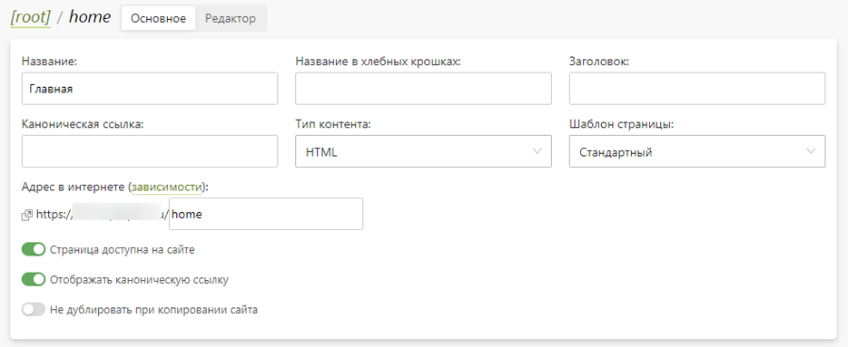
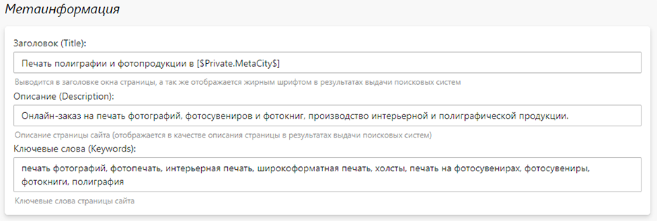

# Страницы сайта
## Типы страниц
* Любой сайт состоит из набора страниц, в совокупности образуя его структуру. Уникальной характеристикой страницы является ее адрес, который в свою очередь может быть абсолютным или относительным. Отличие лишь в том, что абсолютный адрес включает доменное имя (пример: "demo.pixlpark.ru/photos"), а относительный - нет (пример: "/photos").
* В общем случае любую страницу сайта можно представить в виде набора четырех необязательных блоков:
    + Шапка;
    + Меню;
    + Содержимое;
    + Подвал.
* По содержимому все страницы в Pixlpark делятся на три группы:
    + __Системные страницы__ - содержимое формируется по большей части из системного контента. К ним относятся страницы редакторов, авторизации/регистрации, корзины, доставки, оплаты и личного кабинета;
    + __Пользовательские страницы__ - содержимое формируется полностью из контента, размещенного в панели управления в разделе “CMS / Страницы”. К ним относятся, например, главная, продуктовые или каталожные страницы.
    + __Комбинированные страницы__ - содержимое формируется по большей части из объектов, созданных в панели управления. К ним относятся страницы выбора шаблонов, готовых продуктов, сувениров с принтами, бизнес-сувениров, новостей, фотогалереи, базы знаний и гостевой книги.
* Системные и комбинированные страницы имеют определенную структуру адреса, включающий в свой состав ключевые слова. А пользовательские страницы могут иметь любой адрес, но при условии его отличия по структуре.
* Т.к. полное редактирование каждой страницы (включая шапку, меню, содержимое и подвал) является очень трудоемким процессом, был разработан особый механизм компоновки и редактирования страниц.
* 

## Принцип формирования страницы
* __Секция__ - это логический контейнер, из которых компонуется страница. Секция может содержать любую разметку (HTML, JS и CSS).
* __Слой__ - это набор секций, которые могут выводиться на странице. Основной характеристикой слоя является маска - это регулярное выражение для адреса страницы. Если адрес какой-либо страницы соответствует маске, к ней применяется данный слой. Т.е. к содержимому каждой секции страницы добавляется содержимое аналогичного секция слоя.
* __Блок__ - это логически обособленная пользовательская разметка, которая по специальному коду может выводиться в различных секциях или страницах сайта (пример: `[$block:block-name$]`, где “block-name” - название блока). Использование блоков позволяет минимизировать дублирование контента.
* __Константа__ - это динамическая разметка, формируемая по специальному коду для объектов системы. Например, системный блок может выводить калькулятор для категории печати или последние новости.
* __Страница__ - пользовательская страница, которая может содержать все вышеописанные объекты. В панели управления все страницы сгруппированы по папкам в соответствии с их адресами. Обычно такое представление отражает иерархическую структуру сайта.

## Характеристики страницы
* __Название__ - название страницы, которое используется в панели управления и в хлебных крошках (если не задано специальное название).
* __Название в хлебных крошках__ - название страницы, которое используется в хлебных крошках. Если оно не задано, то используется “Название”.
* __Заголовок__ - заголовок страницы (H1), который отображается на странице только в случае отсутствия такого в разметке. Это одна из основных характеристик для поисковых систем.
* __Каноническая ссылка__ - адрес страницы, которую поисковые системы будут считать главной по отношению к текущей (а ее - дубликатом). Каноническую ссылку необходимо задавать, когда эту и другие страницы сайта считаются дубликатами из-за схожести содержимого. Если не определять главную страницу, то поисковые системы могут понижать сайт в выдачи и в произвольном порядке выдавать то одну, то другую страницу на один и тот же запрос.
* __Тип контента__ - тип содержимого страницы, который указывается в ответе сервера в заголовке "content-type". Рекомендуем оставлять значение по умолчанию (HTML).
* __Шаблон страницы__ - предзаданный набор компоновки секций страницы:
    + Стандартный - страница со всеми секциями (рекомендуем использовать ее);
    + Без шапки и подвала - страница без двух обязательных секций "Шапка" и "Подвал";
    + Пустой - страница с одной обязательной секцией "Контент" и без загрузки стандартных скриптов и стилей, которые необходимы для работы системных блоков.
    + Хлебные крошки - переопределение навигационной цепочки для текущей страницы, которая выводится на странице через константу [$breadcrumbs$]. По умолчанию хлебные крошки формируются по вложенности текущей страницы относительно корня сайта (главной страницы). 
* 
* __Метаинформация__ - задание метатегов: заголовка (Title), описания (Description) и ключевых слов (Keywords), которые используются поисковыми системами для ранжирования страниц сайта и отображения их в выдаче.
* 

## Использование констант
* `[$calculator(category:cUrl, product:pUrl, config:view)$]` - калькулятор для категории печати, где:
    + cUrl - адрес категории (обязательный параметр);
    + pUrl - адрес продукта, который будет выбран по умолчанию (опциональный параметр);
    + view - название представления калькулятора (опциональный параметр).
* `[$price(category:cUrl, product:pUrl, quantity:qVal, page:pVal, surface: sVal, zone: zVal)$]` - стоимость продукта без учета опций, где:
    + cUrl и pUrl - описаны выше (обязательные параметры);
    + qVal - количество продуктов (опциональный параметр, по умолчанию = 1);
    + pVal - количество поверхностей печати (опциональный параметр, по умолчанию = 1);
    + sVal и zVal - порядковые номера поверхности и зоны печати, для которых нужно произвести расчет стоимости; используется вместе и без параметра “page”; например, если требуется рассчитать стоимость печати футболки на спине А4  (опциональные параметры).
* `[$ priceWithCustomWorks(category:cUrl, product:pUrl, qantity:qVal, page:pVal, surface: sVal, zone: zVal)$]` - стоимость продукта с учетом обязательных опций.
* `[$ pricePerItem(category:cUrl, product:pUrl, qantity:qVal, page:pVal, surface: sVal, zone: zVal)$]` - стоимость единицы продукта без учета опций.
* `[$ priceString(...)$], [$ priceWithCustomWorksString(...)$], [$ pricePerItemString(...)$]` - стоимость вместе с валютой сайта.
* `[$breadcrumbs$]` - хлебные крошки текущей страницы.
* `[$lastNews$]` - список последних опубликованных новостей, где их количество задается в разделе “Новости / Настройка”.
* `[$fullPath$]` - значение константы локализации, где fullPath - ее путь.
* `[$websiteTitle$]` - название бренда из раздела “__Настройка / Регион → Контакты__”.
* `[$websiteAddress$]` - адрес из раздела “Настройка / Регион → Контакты”.
* `[$websitePhone$]` - телефон из раздела “Настройка / Регион → Контакты”.
* `[$websiteEmail$]` - эл. почта из раздела “Настройка / Регион → Контакты”.
* `[$websiteLogo$]` - абсолютная ссылка на логотип сайта из раздела “__CMS / Дизайн__”.

## Задание маски слоя
* Для задания маски используются следующие термины и формулировки:
   + Регулярное выражение может состоять из нескольких правил. Если они прописаны в одну строку, то между ними применяется условие "И", а если в несколько - "ИЛИ".
   + __Знак "\*"__ - возможность следования любых символов в адресе искомой страницы (неточное совпадение).
   + `url(адрес)` или `+url(адрес)` - задание страницы с указанием ее относительного адреса, к которой нужно применять слой. Пример: `url(/user/cart)`.
   + `-url(адрес)` - задание страницы с указанием ее относительного адреса, к которой не нужно применять слой (в то время как к остальным страницам его применять нужно ). Пример: `url(/user/*) -url(/user/cart)`.
   + `[auth]` – применение слоя только к авторизованным пользователям;
   + `-[auth]` – применение слоя только к не авторизованным пользователям;
   + `[company]` – применение слоя только к клиентам, зарегистрированным в качестве организаций.
   + `-[company]` – применение слоя только к клиентам, зарегистрированным в качестве частных лиц;
   + `[mobile]` – применение слоя только к мобильной версии сайта;
   + `-[mobile]` – применение слоя только к настольной версии сайта.
* Приведем несколько примеров задания маски:
   + `url(*)` – применение слоя к любой странице сайта.
   + `url(*editor*)` – применение слоя к страницам, в адресе которых есть слово "editor".
   + `url(*editor*) -url(*approve*)` – применение слоя к страницам, в адресе которых есть слово "editor", за исключением страниц, в адресе которых есть слово "approve". В данном примере слой будут выводиться на страницах всех редакторов, но не будет выводиться на страницах утверждения макета.
   + `url(/user/cart)` – применение слоя только к странице корзины.
   + `url(/news/*)` – применение слоя к любым страницам новостей, за исключением страницы списка новостей.
   + `url(/news*)` – применение слоя к любым страницам новостей, включая страницу списка новостей.
   + `url(*) [auth]` – применение слоя к любым страницам сайта, но только для авторизованных посетителей.

## Работа с изображениями
* При подготовке изображений для сайта рекомендуем их:
    + подготавливать в минимальном требуемом разрешении;
    + сохранять в современных форматах: __webp, jpg или png__;
    + оптимизировать специальными сервисами типа [imagecompressor.com](https://imagecompressor.com/) или [tinyjpg.com](https://tinyjpg.com/).
* На демо-сайте используются следующие разрешения иллюстрация:
    + Баннер на главной странице:
        + Настольная версия: 1920 x 510 px;
        + Планшетная версия: 1170 x 400 px;
        + Мобильная версия: 530 x 270 px;
    + Продукт страницы каталога: 414 x 341 px;
    + Слайдер страницы продукта: 555 x 310 px;
    + Примеры работ: 1000 x 1000 px;
    + Новость на странице списка: 360 x 220 px;
    + Новость на отдельной странице: 850 x 450 px